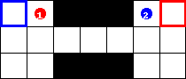

## Class `Memory`
1. attributes
    * `agent_num`: number of agents present
    * `action_dim`: size of the action space
    * For storage:
        * `actions`, `observations`, `reward` = lists
        * `pi`, `done` = list of lists, one for each agent
2. methods
    * `get`: returns current state = tuple of tensors `actions`, `observations`, `pi`, `reward`, `done`
    * `clear`= resets all lists

## Class `Actor` (`nn.Module`)  
* 3 fully connected layers (with ReLU activations)
* returns softmax of size `action_dim`
* quid previous actions?

 Class `Critic` (`nn.Module`)  
* input = `1 + state_dim * agent_num + agent_num`  
* centralised critic that uses observations from all agents
* quid previous actions?
* returns values Q(s, .) for all actions in `action_dim`

## Class `COMA`
* attributes:
    1. `agent_num`, `state_dim`, `action_dim`: all from arguments
    1. `memory`: instance of `Memory`
    1. `actors`: list of Actors, one for each agent
    1. `critic` and `critic_target`: instances of `Critic`
    1. optimizers for all `actors` and the critic

* methods:
    1. `get_actions`
        * argument: `observations`
        * for each agent, computes distribution from `actor`
        * samples action from distribution
        * appends distribution to `memory.pi[agent_idx]` and action to `actions`
        * cosntruct list of actions, one for each agent
        * appends observations and actions to `memory.observations` and `memeory.actions`, resp.
        * return actions (= array of length `agent_num`)
    1. `train`
        * gets  all observation/action history with `memory.get()`
        * For each agent:
            * **train the actor of this agent**
            * create input for critic (with `self.build_input_critic(agent_id, observations, actions)`)
            * compute Q target with critic (+ apply `detach()` to resulting tensor)
            * compute baseline: `sum(pi[agent_id] * Q_target)` = weighted (by policy) over all Q's
            * select Q for actions taken by agent and other agents => `Q_taken_target`
            * advantage = `Q_taken_target` - `baseline`
            * loss for actor = `mean( advantage * log_pi)` where `log_pi = log(pi[agent_idx])`
            * perform backprop for actor network for agent under consideration
            * **train the critic**
            * compute Q (this time with critic and not its target: `critic(input_critic)`)
            * select for actions taken by agent: `Q_taken`
            * discount the rewards for TD(0): `r[t] = reward[t] + gamma * Q_taken[t+1]`
            * compute critic loss: `mean((r - Q_taken)**2)`
            * perform backprop for critic network
        * synchronize target and critic networks every N steps
    1. `build_input_critic`
        * based on `agent_id, observations, actions`, builds an tensor of size `(batch_size x (1 + state_dim*num_agents + agent_num))`: 
            * the aditional 1 is a flag to containing the `agent_id`
            * `state_dim*num_agents` coantins the observations for all agents
            * `agent_num`: contains the action taken by each agent.

## Training Loop
* Defines default configurable values, like `agent_num` = 2, dimensions of `state` and `action` spaces, $\gamma$, learning rates for critic (= 0.005) and actors (= 0.0001) and target update steps.
* Uses gym["Switch2-v0"] as environment:

    ### <ins>ma-gym - `Switch2-v0`</ins>

    A grid world environment having `n` agents where each agent wants to move their corresponding home location ( marked in boxes outlined in same colors). The challenging part of the game is to pass through the narrow corridor through which only one agent can pass at a time. They need to coordinate to not block the pathway for the other. A reward of +5 is given to each agent for reaching their home cell. The episode ends when both agents has reached their home state or for a maximum of 100 steps in environment.

    * Action space: `0: Down, 1: Left, 2: Up, 3: Right, 4: Noop`
    * Agent observation: `Agent coordinate + steps in env.`
    * Reference paper: [Value-Decomposition Networks For Cooperative Multi-Agent Learning ( Section 4.2)](https://arxiv.org/abs/1706.05296)

    

* Loops while max number of episodes is not reached (default: `n_episodes = 10000`):
    * Get actions from agents based on current `obs`: `actions = agents.get_actions(obs)` and then perform actions in environment and receive `next_obs, reward, done_n, _ = env.step(actions)`
    * Appends `reward` and `done` to the memory of `agents`
    * When all agents are done (`all(done_n) == True`), meaning the episode is over:
        * store the `episode_reward`, which is the accumulate sum of all rewards during the previous episode, in a list called `episodes_reward`
        * Every 10th episode, perform training of agents: `agents.train()`